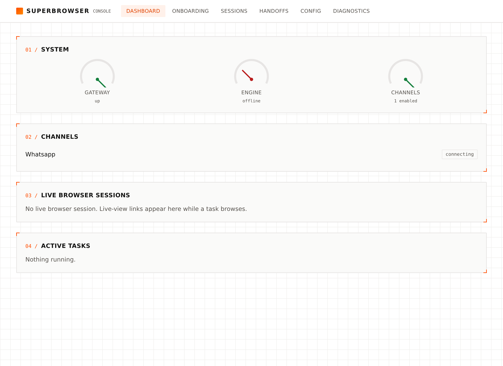
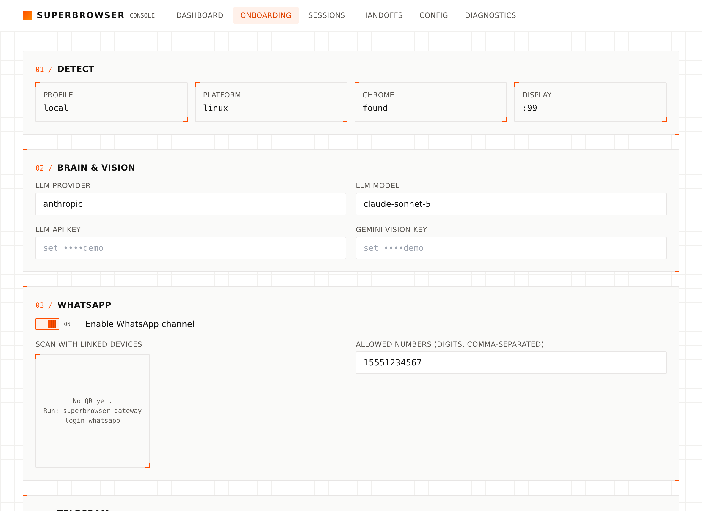

<div align="center">


# SuperBrowser

**The browser your agent won't get blocked on.**

<p>
  <a href="https://pypi.org/project/runagent-superbrowser/"></a>
  <a href="https://www.npmjs.com/package/runagent-superbrowser"></a>
  <a href="LICENSE"></a>
  
  
  
</p>
<p>
  
  
  
  
</p>

[Run it](#run-it--sdk-docker-or-npm) · [Chat & console](#drive-it-from-a-chat-app) · [Examples](#examples) · [What it does](#what-it-does) · [Config](#configuration) · [Docs](#documentation)

</div>

---

Give your agent a real browser. SuperBrowser handles the parts that break LLMs in the wild — captchas, Cloudflare, autocomplete dropdowns, "let me Google that" drift — so your prompt can stay focused on the task.

```python
from runagent_superbrowser import SuperBrowser

sb = SuperBrowser()

# One call. The agent decides whether a lightweight fetch or a full browser
# session is the right tool — you just say what you want, no "please click…".
res = sb.run("find me a black summer dress under $80 on zara.com, size M, ships to Dhaka")
print(res.text)
```

---

## Run it — SDK, Docker, or npm

Three ways to run the same thing locally. Two moving parts: the **engine** (the
TypeScript stealth-browser server on `:3100`) and the **SDK** (the Python brain
that drives it). Pick the setup that fits you.

### 1. Host engine + Python SDK — `npm run dev`

Run the engine on your host, drive it with the SDK in-process. This is
[`examples/03_browser_mode.py`](examples/03_browser_mode.py).

```bash
npm install && npm run build            # once
npm run dev                             # TS engine on :3100 (watch mode)
python examples/03_browser_mode.py      # the SDK, in another shell
```

Or let the SDK start and stop the engine for you (what example 03 does — no
second shell):

```python
from runagent_superbrowser import SuperBrowser

with SuperBrowser(auto_start_server=True, server_cmd=["npm", "run", "dev"]) as sb:
    print(sb.run("book a 4-star Sylhet hotel Sun–Thu", url="https://gozayaan.com", mode="browser").text)
```

### 2. Docker all-in-one — `docker compose`

One container runs the engine **and** the orchestrator, exposed on `:8450` — no
Node/Python/venv on the host, no RunAgent key. This is
[`examples/07_local_docker.py`](examples/07_local_docker.py) (or `06`).

```bash
cp deploy/.env.example deploy/.env      # set the brain (below) + a provider key
docker compose up -d --build            # agent server on :8450 (‑‑build after any Dockerfile change)
python examples/07_local_docker.py      # the SDK talks to the container
```

```python
sb = SuperBrowser(remote=False, local_agent_url="http://localhost:8450")
print(sb.run("what's the top story on Hacker News?").text)
```

To make Docker's brain **identical to your host**, hand the container your
nanobot config verbatim — it reproduces the model *and* its loop tuning — and
leave `LLM_MODEL` unset (setting both would override the delivered model):

```bash
echo "NANOBOT_CONFIG_JSON_B64=$(base64 -w0 ~/.nanobot/config.json)" >> deploy/.env
```

### 3. uv — no manual venv, reproducible from the lockfile

[`uv`](https://docs.astral.sh/uv/) builds an isolated env from `uv.lock` and runs
either path above. `runagent` (needed only for the Docker/local-agent SDK) pins
an old `websockets`; a `[tool.uv]` override reconciles it, so `uv sync` just works.

```bash
uv sync                                 # base SDK → in-process / npm-dev mode (example 03)
uv sync --extra remote                  # + runagent → Docker / local-agent mode (examples 06, 07)
uv run patchright install chromium      # host browser mode needs the stealth Chromium (skip for Docker-only)

uv run python examples/03_browser_mode.py
uv run python examples/07_local_docker.py
```

### Or deploy to serverless

Callable from *every* RunAgent SDK (Python / TS / Go / Rust / Dart / C#), with
on-demand micro-VMs and per-user persistent sessions:

```bash
runagent init my-browser --from-template superbrowser/default   # or: cd deploy
cp .env.example .env     # set LLM_MODEL + OPENAI_API_KEY (or ANTHROPIC_API_KEY)
runagent deploy .        # prints an agent_id
```

Then `RunAgentClient(agent_id, "run", local=False, persistent_memory=True).run(task="…")`.
See [deploy/README.md](deploy/README.md) and
[docs/sdk.md](docs/sdk.md#deploy-via-the-runagent-cli-callable-from-every-sdk).

---

## Python SDK

`pip install runagent-superbrowser` gives you a one-object SDK. Terse goals in,
structured results out — the heavy prompting (routing rules, anti-fabrication,
the browser tool ladder) **ships inside the package**, so you don't hand-write
"please click… please type…".

```python
from runagent_superbrowser import SuperBrowser

sb = SuperBrowser()
res = sb.run("what's the top story on Hacker News right now?")
print(res.text)        # the answer
print(res.success)     # did it work?
```

### Pick how it browses — or let it decide

`mode` is the intelligence switch:

| `mode` | What runs | Needs the engine? |
|---|---|---|
| `"auto"` *(default)* | the agent decides: lightweight fetch/search **or** a real browser | only if it picks the browser |
| `"fetch"` | read-only: HTTP / stealth fetch / search. Fast, no captcha risk | no |
| `"browser"` | a real headless browser — clicks, forms, logins, bookings | yes |

```python
sb.run("average price of used iPhone 16 Pro on mercari.com", mode="fetch")
sb.run("book a 4-star Sylhet hotel, Sun–Thu, 2 adults", url="https://gozayaan.com", mode="browser")
```

In `auto` mode the result tells you which way it leaned, and why:

```python
res = sb.run("cheapest DAC→BKK flight Apr 30, return May 5")
print(res.classification)   # {'approach': 'browser', 'reason': '…', 'confidence': 0.88}
```

### Typed results

Pass a pydantic model (or `list[Model]`, or a JSON Schema dict) and get parsed
data back in `res.data` — best-effort, never raises:

```python
from pydantic import BaseModel
from runagent_superbrowser import SuperBrowser

class Hotel(BaseModel):
    name: str
    price_usd: float

res = SuperBrowser().run(
    "list 4–5 star hotels in Sylhet with nightly prices",
    url="https://gozayaan.com", mode="browser",
    output_schema=list[Hotel],
)
for h in res.data or []:    # list[Hotel]; None if the model didn't return clean JSON
    print(h.name, h.price_usd)
```

### The browser engine

Browser mode needs the TS engine on `:3100`. Start it yourself (`superbrowser http`),
or let the SDK start and stop it for you:

```python
with SuperBrowser(auto_start_server=True) as sb:   # spawns the engine, tears it down on exit
    res = sb.run("…", mode="browser")
```

### Async, streaming, cancel + CLI

```python
res = await SuperBrowser().arun("…", mode="fetch")

# Stream step-level events, and cancel from anywhere (even another thread/process).
res = sb.run("book the cheapest DAC→BKK flight", mode="browser", task_handle="trip-1")
sb.cancel("trip-1")            # cooperatively unwinds — no orphaned task in Docker
sb.tasks()                     # list what's running
```

```bash
superbrowser-run "what's trending on github this week" --mode fetch
superbrowser-run "book the cheapest DAC→BKK flight" --mode browser --auto-start-server
superbrowser-run --tasks                     # list running tasks
superbrowser-run --cancel trip-1             # cancel one
```

> Model + API keys come from `~/.nanobot/config.json` (`nanobot onboard`); vision
> and server knobs from env / `.env`. Override per-instance with
> `SuperBrowser(model=…, vision=…, server_url=…, workspace_root=…)`.
> Full guide: [`docs/sdk.md`](docs/sdk.md).

The low-level `register_all_tools(bot)` / raw `/session` HTTP API are still there
for advanced use — see [Examples](#examples).

---

## Drive it from a chat app

Talk to SuperBrowser from **WhatsApp, Telegram, or Discord**. Type a task in
chat, the agent runs it and replies with the answer **plus a screenshot** — and
when it hits a captcha or login wall, **your phone gets a live-view link**: tap,
solve, the session resumes on the same cookies and stays logged in.

```
You (WhatsApp):  "book me a Khulna hotel under $40/night, check-in Apr 23"

  SuperBrowser:  On it — searching gozayaan.com…
                 [captcha] tap to solve: https://browser.example.com/session/abc/view
                           ↑ you tap once, swipe the slider, done

  SuperBrowser:  Found 3 under $40. Top pick: Hotel Castle Salam, $34/night, 4.2★.
                 [screenshot of the results]  Want me to book it?

You (WhatsApp):  "yes, my card on file"
```

Turnkey — no code:

```bash
pip install "runagent-superbrowser[gateway]"
superbrowser-config init            # brain LLM key + Gemini VISION key
superbrowser-gateway setup          # enable WhatsApp / Telegram / Discord
superbrowser-gateway login whatsapp # scan the QR
superbrowser-gateway                # run it — web console at http://127.0.0.1:8460
```

### The web console — no terminal needed

A bundled web console (served on `:8460`) does the whole setup from the browser:
scan the WhatsApp QR, approve who's allowed to talk to the agent, watch live
tasks, manage saved logins, and edit config — all live.

<p align="center">

&nbsp;

</p>

<div align="center"><sub>Dashboard (health gauges + live tasks) · Onboarding (channel setup + WhatsApp QR). White canvas, volcanic-orange industrial UI.</sub></div>

Logins persist — the agent starts already signed in next time. Run one instance
per WhatsApp number with `--home`.

→ [examples/09_channels_quickstart.md](examples/09_channels_quickstart.md) ·
[docs/gateway.md](docs/gateway.md) · [docs/identity.md](docs/identity.md)

*(Building your own bridge instead? The engine still fires
`HANDOFF_WEBHOOK_URL` with `{url, caption, screenshot, …}` on every human
handoff — the gateway is just the batteries-included consumer.)*

---

## What it does

- **Runs through captchas.** Cloudflare, Akamai, DataDome, PerimeterX, Kasada. Auto-pass on warm profiles, Turnstile token solvers, vision-based slider / jigsaw / rotation solvers, or hand off to a human via a live-view URL.
- **Doesn't get fingerprinted.** Per-domain persistent Chrome profiles. First visit takes the hit, every visit after looks like a returning user.
- **Picks the cheapest engine that works.** httpx for plain pages, Puppeteer for SPAs, curl_cffi for TLS-blocked APIs, undetected Chromium for the hard targets, Wayback as a fallback. One tool call, the router does the rest.
- **Stops LLM failure patterns at the tool layer.** No more `"khulnakhulna, bangladesh"` from a missed autocomplete. No more "let me check Google" mid-task. No more re-typing into a closed dropdown.
- **Keeps your reasoning model cheap.** A dedicated tiny vision model labels screenshots into `[V1]`, `[V2]` boxes. Your expensive LLM never sees raw pixels.
- **Hands off to a human when stuck.** Captcha, login, or an approval gate — a live-view link lands in the user's **WhatsApp / Telegram / Discord** chat. They tap once, and the session resumes on the same cookies.
- **Logs in once, stays logged in.** The human logs into a site through the handoff link; the session is saved so the next task starts already signed in — good for checkouts and account pages. ([docs/identity.md](docs/identity.md))
- **Won't leave orphans.** Kill the SDK mid-task and the browser task unwinds instead of running on inside Docker; there's an explicit cancel + task-list API too.

---

## Install

> **Run it locally.** Datacenter IPs (Hetzner, AWS, DigitalOcean…) get blocked
> by a lot of sites. On your own machine — macOS, Windows, or Ubuntu — you look
> like a normal visitor. The one-liner below gets you there on any of them.

### Fastest — one-command bootstrap

**macOS / Linux**

```bash
curl -fsSL https://raw.githubusercontent.com/runagent-dev/runagent-superbrowser/main/scripts/install.sh | bash
```

**Windows (PowerShell)**

```powershell
irm https://raw.githubusercontent.com/runagent-dev/runagent-superbrowser/main/scripts/install.ps1 | iex
```

It clones the repo, installs Google Chrome (+ Xvfb and the headless system libs
on Linux), sets up a Python venv and the patchright Chromium, builds the TS
engine, and writes a `.env`. The only things it won't silently install are the
**Node 20+ / Python 3.11+ runtimes** — it detects them and prints the right
command for your OS so it never clobbers nvm/pyenv. Pass `--check` to dry-run,
`--yes` for non-interactive (`-Check` / `-Yes` on PowerShell).

Then:

```bash
superbrowser-doctor     # verify Chrome, build, env, server
superbrowser            # start the engine on :3100  (alias: npm start)
```

### From packages

The two halves publish separately — the browser engine to npm, the agent bridge
to PyPI:

```bash
# TS browser engine (HTTP + MCP server):
npm install -g runagent-superbrowser

# Python agent bridge (nanobot tools, captcha solving, Tier-3):
pip install runagent-superbrowser
patchright install chromium          # download the stealth Chromium (pip can't)
playwright install-deps chromium     # Linux only: the apt libs Chromium needs
superbrowser-doctor                  # check Chrome, build, env
```

`puppeteer-core` does **not** bundle a browser — you need real Google Chrome on
the machine. The bootstrap installer handles it; if you set things up by hand on
a **fresh Ubuntu/Debian VM**, Chrome isn't in the default apt repos, so
`apt install google-chrome-stable` fails until you add Google's repo first:

```bash
# add Google's signing key + apt source, then install Chrome
wget -q -O - https://dl.google.com/linux/linux_signing_key.pub \
  | sudo gpg --dearmor -o /usr/share/keyrings/google-chrome.gpg
echo "deb [arch=amd64 signed-by=/usr/share/keyrings/google-chrome.gpg] https://dl.google.com/linux/chrome/deb/ stable main" \
  | sudo tee /etc/apt/sources.list.d/google-chrome.list
sudo apt update && sudo apt install -y google-chrome-stable
```

Then point `PUPPETEER_EXECUTABLE_PATH` at the binary:

| OS | Typical Chrome path |
|---|---|
| Ubuntu/Debian | `/usr/bin/google-chrome-stable` |
| macOS | `/Applications/Google Chrome.app/Contents/MacOS/Google Chrome` |
| Windows | `C:\Program Files\Google\Chrome\Application\chrome.exe` |

### Or Docker (all-in-one agent server)

One container runs the stealth browser engine **and** the agent orchestrator on
`:8450` — no Node/Python/venv on the host, no RunAgent key. The run recipe is
[above](#2-docker-all-in-one--docker-compose):

```bash
cp deploy/.env.example deploy/.env      # set the brain + a provider key
docker compose up -d --build            # ready when :8450/api/v1/health is healthy
```

The image bakes Node, real Google Chrome, patchright's stealth Chromium (+ Xvfb
for headful Tier-3), and the Python bridge. Compose gives it `shm_size: 2gb`
(Chrome renderer memory) and persists `~/.superbrowser` (cookies/profiles) and
`~/.nanobot` (orchestrator state) in named volumes across restarts. See
[docs/sdk.md → Local agent server (Docker)](docs/sdk.md) for the full picture
(in-process vs local-agent vs remote).

### Per-OS notes

| | Install Chrome | Headless | Extra |
|---|---|---|---|
| **Ubuntu / Debian** | add Google's apt repo, then `apt install google-chrome-stable` ([snippet above](#from-packages)) | `HEADLESS=true` works; headful Tier-3 needs Xvfb | `apt install xvfb` + the lib list (the installer does this) |
| **macOS** | `brew install --cask google-chrome` | headful, no Xvfb | — |
| **Windows** | `winget install Google.Chrome` | headful (`HEADLESS=false`) | no Xvfb/apt needed |

### From source (contributors)

```bash
git clone https://github.com/runagent-dev/runagent-superbrowser.git
cd runagent-superbrowser
npm install && npm run build            # TS engine
cp .env.example .env                    # then edit the keys you care about
python -m venv venv && source venv/bin/activate
pip install -r requirements.txt         # Python bridge (pinned dev lockfile)
patchright install chromium
playwright install-deps chromium        # Linux only
npm start                               # engine on :3100 — no API key needed
```

**Prefer `uv`?** Skip the venv + `pip install -r` steps — `uv sync` builds the
env from `uv.lock` and `uv run` runs anything in it:

```bash
uv sync --all-extras                    # base + puzzles + remote (runagent) + dev
uv run patchright install chromium
uv run pytest nanobot/superbrowser_bridge/tests   # the offline suite
```

See [`CONTRIBUTING.md`](CONTRIBUTING.md) for the dev + release workflow.

---

## Examples

**Screenshot anything.**

```bash
curl -X POST http://localhost:3100/screenshot \
  -d '{"url": "https://example.com"}' \
  -H "Content-Type: application/json" --output shot.jpg
```

**Drive a session from any language.**

```python
import httpx
r = httpx.post("http://localhost:3100/session/create", json={"url": "https://news.ycombinator.com"})
sid = r.json()["sessionId"]
httpx.post(f"http://localhost:3100/session/{sid}/click", json={"index": 1})
```

**Write a Puppeteer script on the live page.**

```python
httpx.post(f"http://localhost:3100/session/{sid}/script", json={
    "code": "await page.type('#q', 'agents'); await page.click('#search'); return page.title();"
})
```

**Let the autonomous agent do it.**

```bash
curl -X POST http://localhost:3100/task \
  -d '{"task": "find trending Python repos this week on GitHub"}' \
  -H "Content-Type: application/json"
```

**Tasks that actually work:**

```python
await bot.run("book a 3-day stay in Khulna on gozayaan.com, check-in April 23, 1 adult, under $40/night")
await bot.run("find the cheapest flight DAC → SIN on March 5, one-way, list top 3 airlines")
await bot.run("get the IRA contribution limit for someone 45yo earning $120k from the Chase calculator")
await bot.run("compare the iPhone 16 Pro on amazon.com vs. apple.com — price, ship date, return policy")
await bot.run("download the latest 10-K filing for NVDA from the SEC EDGAR site")
```

When SuperBrowser hits a captcha it can't auto-solve, your phone buzzes with a link. Tap, swipe, done.

---

## Configuration

### LLM brain — one `.env`, every mode

The agent's brain needs a model + provider key. Either run `nanobot onboard` once,
**or** put it in `.env` — the SDK bridges `.env` into nanobot's config for you, and
the **same keys work locally, in Docker, and on serverless**:

```bash
LLM_MODEL=gpt-4o
OPENAI_API_KEY=sk-...        # or ANTHROPIC_API_KEY, or the LLM_PROVIDER/LLM_API_KEY contract
```

Precedence is "onboard wins, `.env` bootstraps": a `.env` only (re)writes nanobot's
config when you set an explicit `LLM_*` var or haven't onboarded yet, so a stray
exported key never clobbers a deliberate `nanobot onboard`. Details:
[docs/sdk.md → Configuration & `.env`](docs/sdk.md#configuration--env).

**Prefer one config file?** `superbrowser-config init` writes
`~/.superbrowser/config.json` with a machine profile (`local` / `vm` / `docker`)
and just the keys you need — a laptop needs only the brain key + `VISION_API_KEY`.
It projects into the same env vars, so `.env` and the shell still win. Full
reference + the precedence rules: [docs/CONFIG.md](docs/CONFIG.md). Security
notes (tokens, saved logins, viewer exposure): [SECURITY.md](SECURITY.md).

### Engine knobs

Zero config required. The knobs that matter most:

| Variable | What it does |
|---|---|
| `T3_PERSIST_PROFILE=1` | Persistent per-domain Chrome profiles. **Turn this on.** First visit solves the captcha, every visit after looks like a returning user. |
| `HANDOFF_WEBHOOK_URL` | Fires when a human is needed. Point it at your WhatsApp / Slack / Telegram bridge. |
| `CAPTCHA_API_KEY` + `CAPTCHA_PROVIDER` | 2captcha / anticaptcha / nopecha for Turnstile auto-solve. |
| `VISION_API_KEY` + `VISION_MODEL` | Cheap dedicated vision model. Keeps image tokens off your reasoning LLM bill. |
| `PROXY_POOL` + `PROXY_POOL_RESIDENTIAL` | Datacenter + residential pools. Hardened domains auto-promote to residential. |
| `TOKEN` | Bearer auth. Set this for anything not on localhost. |
| `SUPERBROWSER_IDENTITY_JAR=1` | "Log in once, stay logged in" — persist a site's full login so later tasks start signed in. See [docs/identity.md](docs/identity.md). |
| `SUPERBROWSER_TASK_ID` | Scope key for the cookie jar. Pass a stable ID for warm starts. |

Full reference: [`.env.example`](.env.example) · unified `config.json` + machine profiles: [docs/CONFIG.md](docs/CONFIG.md) · Tier-3 stealth deep dive: [`STEALTH.md`](STEALTH.md).

---

## Documentation

| Guide | What's in it |
|---|---|
| [docs/sdk.md](docs/sdk.md) | Python SDK — modes, in-process vs Docker vs serverless, streaming, config precedence |
| [docs/CONFIG.md](docs/CONFIG.md) | Unified `config.json`, machine profiles (`local`/`vm`/`docker`), env precedence, `superbrowser-config` |
| [docs/gateway.md](docs/gateway.md) | Chat channels (WhatsApp/Telegram/Discord) + web console, multi-number, Docker opt-in, tunnels |
| [docs/identity.md](docs/identity.md) | "Log in once, stay logged in" — the identity jar, login handoff, threat model |
| [docs/data-layout.md](docs/data-layout.md) | Everything under `~/.superbrowser/` — cookies, identities, profiles, how to wipe it |
| [STEALTH.md](STEALTH.md) | Tier-3 (real Chrome + Xvfb) stealth, persistent profiles, the anti-detection stack |
| [SECURITY.md](SECURITY.md) | Token model, saved-login exposure, live-view/tunnel guidance, gateway binding rules |
| [deploy/README.md](deploy/README.md) | Serverless deploy via the RunAgent CLI, callable from every RunAgent SDK |
| [CONTRIBUTING.md](CONTRIBUTING.md) | Dev setup, the two-halves layout, running the tests |

---

## Where this is going

[RunAgent Cloud](https://runagent.cloud) — a managed serverless deployment with per-user persistent profiles surviving cold starts, controlled via chat apps. The pieces are already here; the cloud substrate is what's next.

---

## License

MIT — see [LICENSE](LICENSE).
